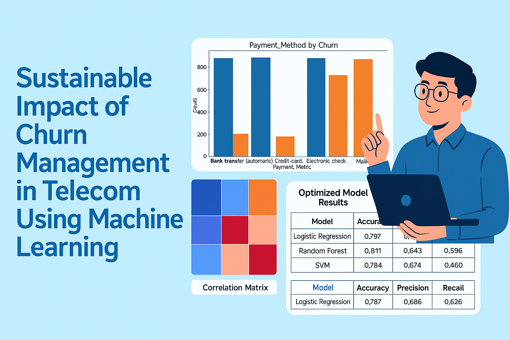

# Sustainable Impact of Churn Management in Telecom Using Machine Learning
### A Data-Driven Approach to Customer Retention and Sustainable Growth

---

## 📘 Project Overview
This project examines how telecom companies can use **machine learning** to manage customer churn sustainably — reducing loss, improving loyalty, and minimizing environmental impact from data operations.

In simple terms, it answers three business questions:
1. Why do customers leave telecom providers?
2. How can we predict and prevent churn early?
3. Can technology choices make churn management both profitable and eco-friendly?

By combining **Python-based analytics** with **Excel data preparation**, this project demonstrates how data-driven insights can drive **financial stability**, **operational efficiency**, and **sustainability** in the telecom industry.

---

## 🎯 Objectives
- Identify key drivers behind customer churn.  
- Develop predictive models to flag high-risk customers.  
- Compare model accuracy and energy efficiency.  
- Recommend practical strategies that balance profit and sustainability.

---

## 🧠 Dataset & Tools
- **Dataset:** Telco Customer Churn (IBM/Kaggle)  
- **Records:** 7,043 customers  
- **Tools:** Python (Pandas, Matplotlib, Seaborn, Scikit-learn) and Microsoft Excel  
- **Key Variables:** tenure, monthly charges, contract type, payment method, churn label  

The data covers customer demographics, billing habits, contract details, and service preferences — all critical for understanding customer behavior.

---

## 📊 Key Insights at a Glance

### 1️⃣ Overall Churn Pattern

About **26% of customers discontinued their service**, signaling both high competition and the need for proactive engagement.  

Shorter-term contracts and flexible payment methods show the highest churn risk.

---

### 2️⃣ What Drives Customers Away

Analysis showed three main causes of customer loss:
- **Price dissatisfaction** – many users leave due to high or inconsistent charges.  
- **Poor customer experience** – delays or lack of personalized support.  
- **Competitor attraction** – switching for better offers or modern digital service.  

These highlight areas where customer satisfaction and loyalty programs can have the biggest payoff.

---

### 3️⃣ Tenure, Charges, and Churn Relationship

- Customers staying **less than 12 months** are the most likely to leave.  
- **Higher monthly bills** correspond to greater churn probability.  
- Loyal, long-tenure customers tend to remain regardless of pricing, showing the value of long-term relationships.

---

### 4️⃣ Contract & Payment Dynamics


- **Month-to-month contracts** see the highest churn, while annual contracts build retention.  
- Customers paying via **electronic check** churn more frequently than those using automatic payments or credit cards.  

These insights guide practical policy decisions for subscription models and payment structures.

---

## 🔍 Correlation Highlights

Strong links were found between:
- **Tenure & Churn:** long-term customers rarely leave.  
- **Charges & Churn:** higher costs push customers away.  
- **Contract Type & Churn:** flexible plans bring volatility but also opportunity for tailored retention.

---

## ⚙️ Model Development & Evaluation

Three algorithms were trained and compared:
- **Logistic Regression** – simple, interpretable baseline.  
- **Random Forest** – ensemble model for robust pattern detection.  
- **Support Vector Machine (SVM)** – powerful but computationally heavy.

The goal wasn’t just accuracy — but also **efficiency**. Energy consumption during training was measured to ensure sustainability.

---

### 📈 Model Results


| Model | Accuracy | Precision | Recall | F1-Score |
|--------|-----------|-----------|--------|-----------|
| Logistic Regression | 79.7% | 68.5% | 52.8% | 59.6% |
| Random Forest | **81.1%** | **71.3%** | **55.8%** | **62.6%** |
| SVM | 78.4% | 67.4% | 46.0% | 54.7% |

🔹 **Random Forest** gave the most balanced predictions, identifying churned customers effectively without overfitting.  
🔹 **Logistic Regression** proved the most energy-efficient, consuming the least power per computation cycle.

---

### 🌱 Energy and Sustainability Metrics


| Model | Energy Used (kWh) | CO₂ Emission (kg) | Comment |
|--------|--------------------|-------------------|----------|
| Logistic Regression | 0.000000 | 0.00000138 | Most sustainable option |
| SVM | 0.000020 | 0.00001069 | Highest energy consumption |
| Random Forest | 0.000004 | 0.00002329 | Strong accuracy-efficiency balance |

By evaluating the **carbon footprint of machine learning**, this project shows how AI can be both **smart and sustainable**.

---

## 💡 Business Takeaways
- **Retention starts early:** Engaging short-tenure customers can prevent most churn.  
- **Incentivize loyalty:** Discounts or added benefits for long-term contracts reduce customer turnover.  
- **Smart modeling saves energy:** Choosing leaner ML models lowers carbon emissions and computing costs.  
- **Data-driven policy:** Regular churn prediction can cut marketing waste and improve long-term profitability.

---

## 🏛️ Impact for Stakeholders

**For Business Executives:**  
Supports strategic decision-making on customer retention, pricing, and green operations.  

**For Data Teams:**  
Demonstrates the value of integrating machine learning with environmental metrics.  

**For Investors:**  
Highlights how sustainable analytics can deliver both financial and ethical returns.

---

## 📁 Repository Structure
```plaintext
Sustainable-Impact-of-Churn-Management-in-Telecom-Using-Machine-Learning/
│
├── datasets/                           # Telco churn dataset
├── Python Scripts/                     # Model training, evaluation, and visualization
├── Visuals/                            # Analytical visuals and model comparisons
│   ├── Churn Distribution.png
│   ├── Distribution of Churn Reasons.png
│   ├── Boxplot of Relationship between Tenure_Months and Churn.png
│   ├── Payment Method by Churn.png
│   ├── Impact of Different Contract Types on Churn Rates.png
│   ├── Heatmap of Continuous Variables and Churn Label.png
│   ├── Optimized Model Results Table.png
│   └── Energy Consumption Result for SVM, Logistic Regression and Random Forest.png
└── README.md
````

---

## 👤 Author

**Solomon Okpuno**
Data Analyst | Machine Learning & BI Developer | Sustainability Advocate
📍 United Kingdom
🔗 [LinkedIn](https://linkedin.com/in/solomon-okpuno-51a907312) | [GitHub](https://github.com/okpunosolomon) | [Email](mailto:okpunosolomon20@gmail.com)

---

⭐ *If this project inspired your interest in sustainable analytics, please star the repository to support ethical innovation in telecom data science.*

```
